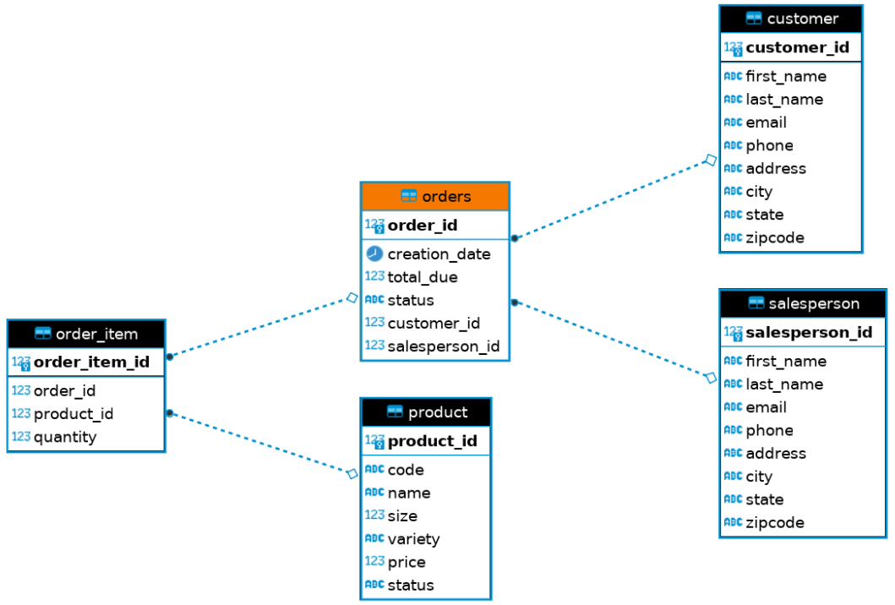

# Introduction
This app implements a Java Database Connectivity
DAO for simple CRUD operations. Maven managed the app's build dependencies, Docker containers deployed the PostgreSQL database, and DBeaver tested and verified database results.  

# Implementation
## ER Diagram

## Design Patterns
Design patterns are implementation guidelines for accessing a database via JDBC.
### DAO
The DAO pattern is a design that abstracts the database by creating Data Transfer Objects (DTO) and Data Access Objects (DAO). DTOs are often coding representations of database table entries, and the DAOs are interfaces that provide create, read, update, and delete (CRUD) operations on these objects.  
A DAO may access multiple tables for a DTO and retrieves data by performing queries and joins in the database.
### Repository
The repository design follows the same initial principles as DAO but at a higher level, often importing DAO implementation. Instead of abstraction of data persistence, the repository design is an abstraction of a collection of objects. For example, specific use cases may use multiple DAO calls, then join data in repository code instead of database commands.

# Test
Database populated using scripts in `sql/`.

Due to the inherent difficulty of formatting results and the small test domain, manual testing was preferred over JUnit testing.
This was done by running SQL commands on PSQL container and having the query results compared manually against JDBCExecutor results.