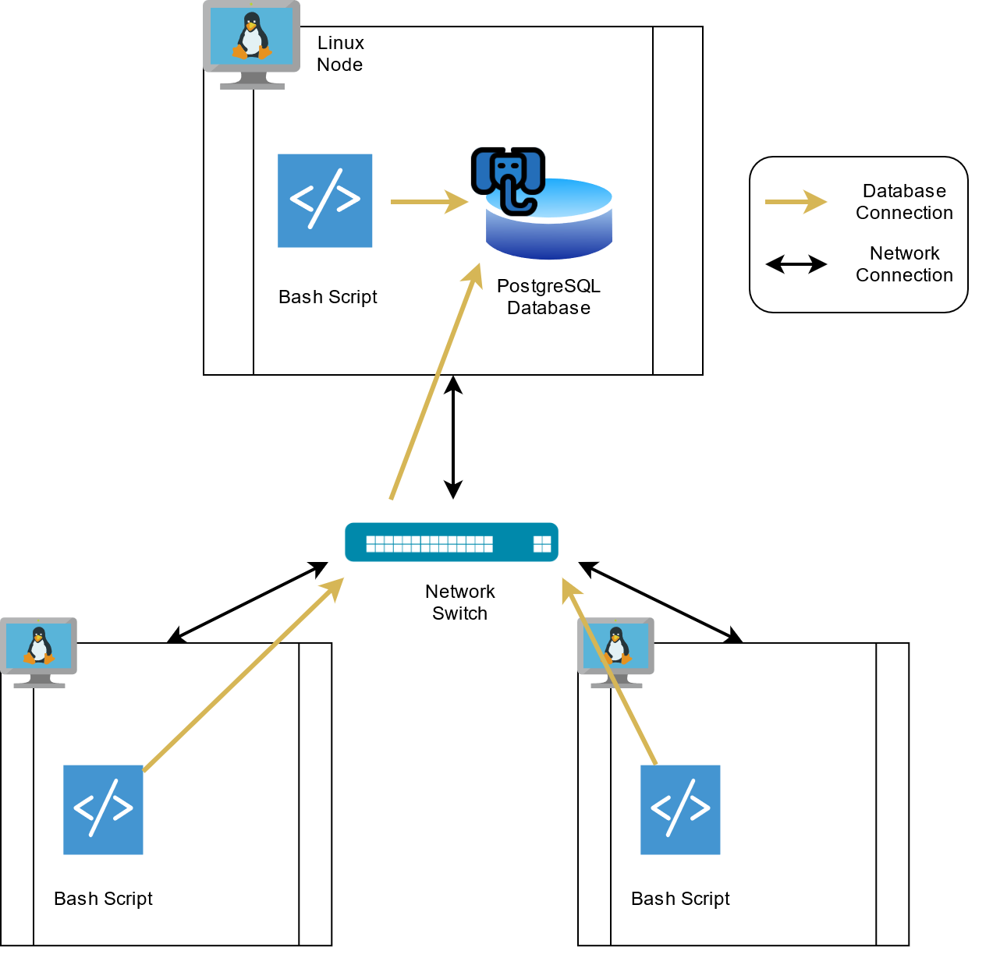
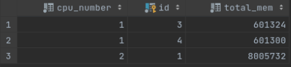
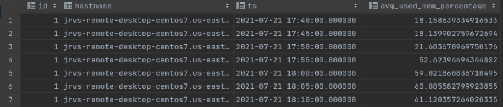
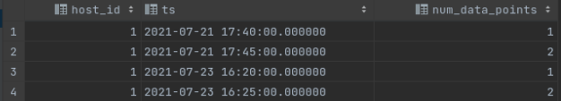

# Linux Cluster Monitoring Agent

## Introduction
The Linux/SQL project is a resource usage tracker of servers in an internal network, designed for use by the Jarvis Linux Cluster Administration (LCA) team to manage a Linux cluster of 10+ nodes/servers running CentOS 7. 

Each server node is instantiated on the Google Cloud Platform, running a Linux kernel with CentOS 7. On a primary node, a local PostgreSQL database container was built using a Docker Hub image. This database stores and manages the collected data from each node, with two tables: host_info and host_usage, tracking the node's hardware specifications and resource usage. 

Bash scripts initiate data collection on each node. Host_info.sh is called only once on setup, whereas resource usage data, host_usage.sh, is called every minute via crontab triggers.  
 
Three SQL queries are provided to analyze the collected database data. These queries include grouping nodes by hardware info, calculating the average memory usage of each node over 5-minute intervals, and detecting node failures.  

Finally, this project uses the git version control system and the GitFlow model for managing repository branches and implementing features. 

## Quick Start
On the primary node:
```bash
    #create local PostgreSQL container from Docker image 
    ./scripts/psql_docker.sh create [db_username] [db_password]

    #create host_info and host_usage tables in the host_agent database
    psql -h localhost -U postgres -d host_agent -f sql/ddl.sql
```

On all nodes (including primary):
```bash
    #Add a current node's hardware information entry to the host_info table
    ./scripts/host_info.sh "localhost" 5432 "host_agent" [db_username] [db_password] 

    #Edit crontab jobs
    bash> crontab -e
    #Triggers data usage collection entry every minute to the host_usage table
    * * * * * bash :path to:/linux_sql/scripts/host_usage.sh "localhost" 5432 "host_agent" [db_username] [db_password] > /tmp/host_usage.log
```

See resource usage tracker results:
```bash
    psql -h localhost -U postgres -d host_agent -f sql/queries.sql
```

## Implementation
- PSQL & Docker: `psql_docker.sh` bash script creates a local PostgreSQL container from a Docker Hub image
- Creating DDL: `ddl.sql` SQL statements create the `host_info` and `host_usage` tables in the `host_agent` database  
- Monitoring Agent: `host_info.sh` and `host_usage.sh` bash scripts send node entries into the database tables 
- SQL Queries: `queries.sql` SQL statements to analyze database data and answer business questions 

### Architecture

- All Linux nodes are connected internally via a network switch
- Each node runs copies of the bash script files and sends data to the primary node's database

### Scripts
- `psql_docker.sh` is used to create, start, or stop the PSQL container
```bash
    ./scripts/psql_docker.sh create [db_username] [db_password]
    ./scripts/psql_docker.sh start
    ./scripts/psql_docker.sh stop
```
- `ddl.sql` creates the host_info and host_usage tables in the host_agent database
```bash
    psql -h localhost -U postgres -d host_agent -f sql/ddl.sql
```
- `host_info.sh` adds an entry of the node's hardware specifications into the host_info table
```
    ./scripts/host_info.sh [psql_host] [psql_port] [db_name] [psql_user] [psql_password]
```
- `host_usage.sh` adds a timestamped entry of the node's current resource usage into the host_usage table
```bash
    ./scripts/host_usage.sh [psql_host] [psql_port] [db_name] [psql_user] [psql_password]
```
- `crontab` is used to trigger bash scripts at specified time intervals
```bash
    #Edit crontab file
    bash> crontab -e

    #Add following line to the file
    * * * * * bash :path to:/linux_sql/scripts/host_usage.sh [psql_host] [psql_port] [db_name] [psql_user] [psql_password] > /tmp/host_usage.log
```
- `queries.sql` is used to analyze the collected database data. Queries include: 
  - grouping nodes by hardware info, sorted by smallest cpu_number and largest total_mem first 
  - calculating the average memory usage of each node over 5-minute intervals, sorted by time
  - detecting for node failures by filtering for 5-minute intervals with less than 3 table entries, sorted by time
```bash
    psql -h localhost -U postgres -d host_agent -f ./sql/queries.sql
```

### Database Modeling
##### Host_info
Variable | Datatype | Constraint | Description 
--------------|-----|-----------|------------
id | `SERIAL` | `PRIMARY KEY` | Unique identifier for a node, auto increments with a new entry
hostname | `VARCHAR` | `NOT NULL` | Name of the host machine 
cpu_number | `INTEGER` | `NOT NULL` | Number of CPUs of host machine
cpu_architecture | `VARCHAR` | `NOT NULL` | CPU architecture type
cpu_model | `VARCHAR` | `NOT NULL` | CPU processor model type
cpu_mhz | `NUMERIC` | `NOT NULL` | CPU processor speed (MHz)
L2_cache | `INTEGER` | `NOT NULL` | Storage size of the L2 Cache (kB)
total_mem | `INTEGER` | `NOT NULL` | Total memory of host machine (kB)
timestamp | `TIMESTAMP` | `NOT NULL` | Table entry time of host_info.sh (UTC) 

##### Host_usage
Variable | Datatype | Constraint | Description 
--------------|----|--|--------------
timestamp | `TIMESTAMP` | `PRIMARY KEY` | Table entry time of host_usage.sh (UTC) 
host_id | `INTEGER` | `REFERENCES host_info(id)` | Foreign key linked to the id in host_info table
memory_free | `INTEGER` | `NOT NULL` | Currently unused memory (MB) 
cpu_idle | `INTEGER` | `NOT NULL` | Current CPU in idle (%) 
cpu_kernel | ` INTEGER ` | `NOT NULL` | Current CPU taken by kernel (%) 
disk_io | `INTEGER` | `NOT NULL` | Number of disk I/O
disk_available | `INTEGER` | `NOT NULL` | Available disk space of the root directory (MB)

## Test
Testing was done on the `psql_docker.sh`, `ddl.sql`, `host_info.sh`, and `host_usage.sh` scripts and verified by checking if the container, database, tables, and table entries were created successfully.

Mock data entries were manually inserted into the database for testing the `queries.sql` code to compare the filtered results with the expected results.
Grouping nodes by hardware info:



Calculating the average memory usage of each node over 5-minute intervals:



Detecting for node failures was done by stopping the PSQL container to prevent new entries:



All tests passed.

## Deployment
- Software configuration management was done on Github
- The PostgreSQL container was built using Docker, with the image retrieved from Docker Hub  

## Improvements
- Automate all scripts into one setup command
- Implement database rollover to delete old host_usage timestamp entries
- Routinely check for PSQL container failure and restart when detected
- Add support for distributed system clusters not on `localhost`
